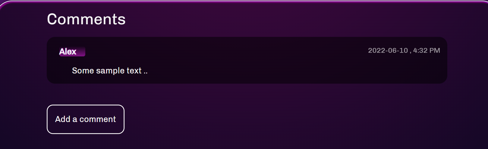

# Audley

Landing Page

Blogs Main

Blog Individual

Create a Post

Comments 

---

Login            |  Register
:-------------------------:|:-------------------------:
 |   

Profile

MyJobs

Job Main

Job Details

ER Diagram

API ROOT

